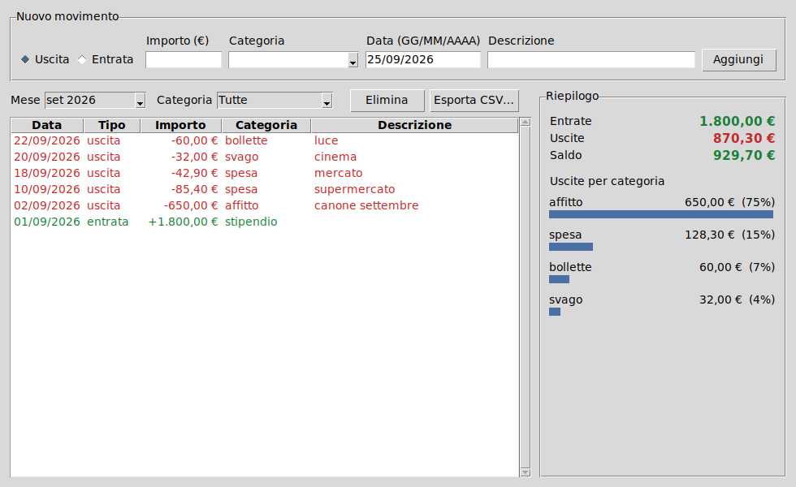

# Gestore di spese 💶

Piccolo programma per registrare entrate e uscite e vedere dove vanno i soldi.
Ha una finestra grafica e, per chi preferisce, dei comandi da terminale.
Usa solo la libreria standard di Python (3.9+): nessuna dipendenza da installare.



## Come avviarlo

1. Installa Python da <https://www.python.org/downloads/> (su Windows spunta **"Add Python to PATH"**).
2. Scarica il progetto (pulsante verde **Code → Download ZIP** su GitHub) ed estrai lo ZIP.
3. Apri la finestra:
   - **Windows**: doppio clic su `Gestore spese.pyw`.
   - **Mac / Linux**: apri il terminale nella cartella ed esegui `python3 -m spese`.
   - **Qualsiasi sistema**: apri `Gestore spese.pyw` con IDLE (installato insieme a Python) e premi **F5**.

Nella finestra:
- compila **Importo**, **Categoria**, **Data** (GG/MM/AAAA) ed eventualmente **Descrizione**, poi premi **Aggiungi** o Invio;
- usa i filtri **Mese** e **Categoria** per restringere la tabella e il riepilogo;
- seleziona una riga e premi **Elimina** (o il tasto Canc) per cancellarla;
- **Esporta CSV…** salva i movimenti visibili in un file apribile con Excel.

Su Linux, se manca tkinter: `sudo apt install python3-tk`.

## Uso da terminale

```bash
python -m spese entrata 1800 stipendio --data 01/09/2026
python -m spese uscita 85,40 spesa -d "supermercato"
python -m spese lista --mese 2026-09
python -m spese riepilogo --mese 2026-09
python -m spese elimina 3
python -m spese esporta spese.csv
```

Esempio di riepilogo:

```
Entrate:     1.800,00 €
Uscite:        767,40 €
Saldo:       1.032,60 €

Uscite per categoria:
  affitto      650,00 €   84.7%  █████████████████
  spesa         85,40 €   11.1%  ██
  svago         32,00 €    4.2%  █
```

| Comando | Cosa fa |
|---|---|
| `entrata IMPORTO CATEGORIA` | registra un'entrata (`-d` descrizione, `--data GG/MM/AAAA`) |
| `uscita IMPORTO CATEGORIA` | registra un'uscita (stesse opzioni) |
| `lista` | elenca i movimenti |
| `riepilogo` | totale entrate/uscite, saldo e uscite per categoria |
| `elimina ID` | elimina un movimento |
| `esporta FILE.csv` | esporta in CSV (apribile con Excel) |
| `finestra` | apre la finestra grafica (è anche il comportamento senza comandi) |

`lista`, `riepilogo` ed `esporta` accettano i filtri `--mese AAAA-MM`, `--categoria NOME` e `--tipo entrata|uscita`.

Finestra e terminale condividono gli stessi dati, salvati in `.spese.json` nella tua cartella utente. Per usare un altro file: `--file percorso.json` oppure la variabile d'ambiente `SPESE_FILE`.

Per avere il comando `spese` al posto di `python -m spese`: `pip install -e .`

## Test

```bash
python -m unittest -v
```

## Struttura

- `spese/core.py`: modello dei movimenti, salvataggio JSON, filtri e calcolo del riepilogo
- `spese/gui.py`: finestra grafica (tkinter)
- `spese/cli.py`: comandi da terminale (argparse)
- `Gestore spese.pyw`: avvio con doppio clic
- `tests/test_spese.py`: test automatici
